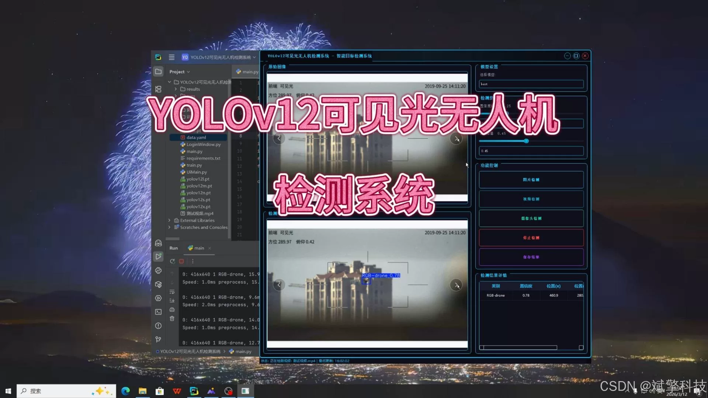
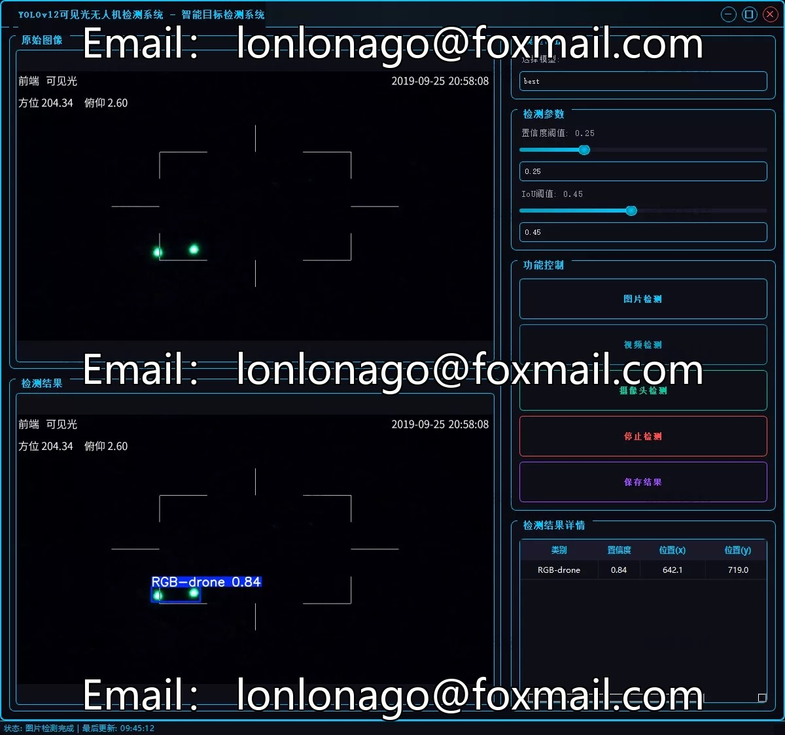
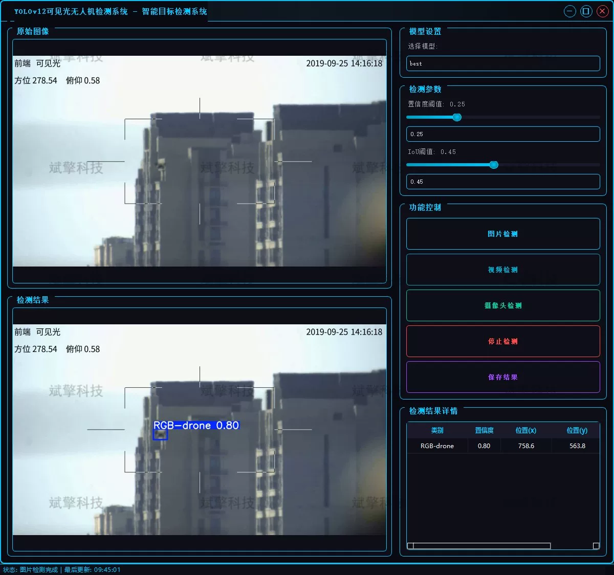
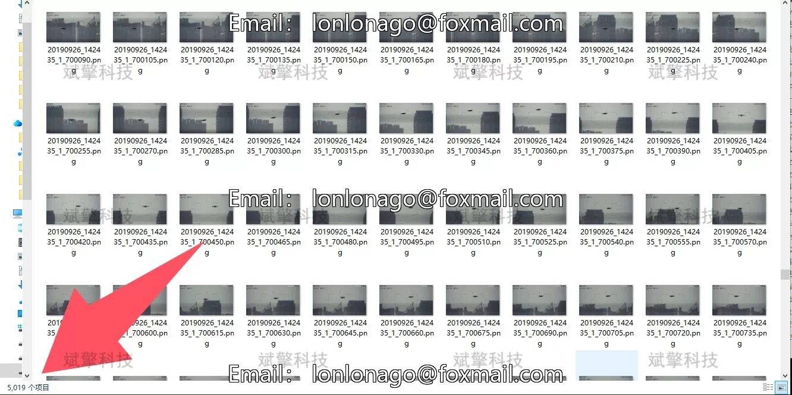
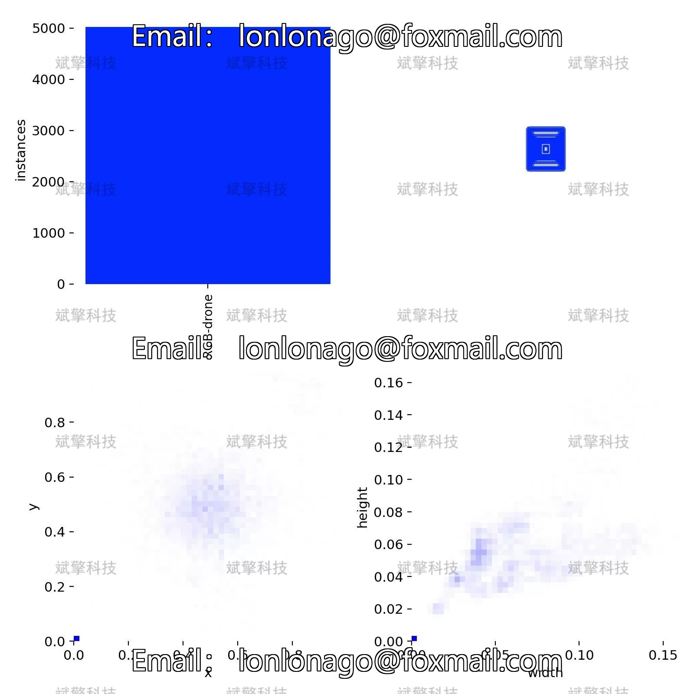
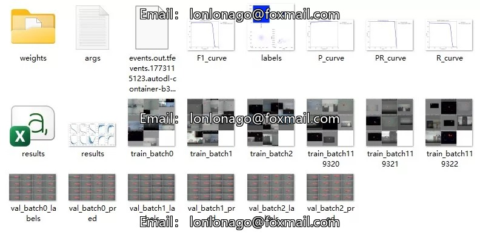
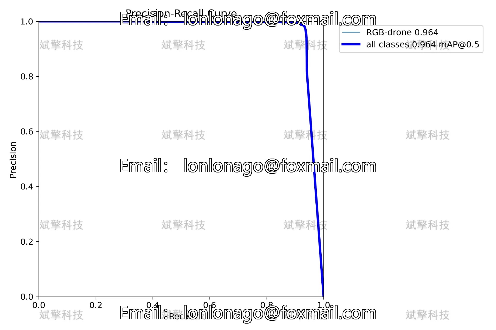
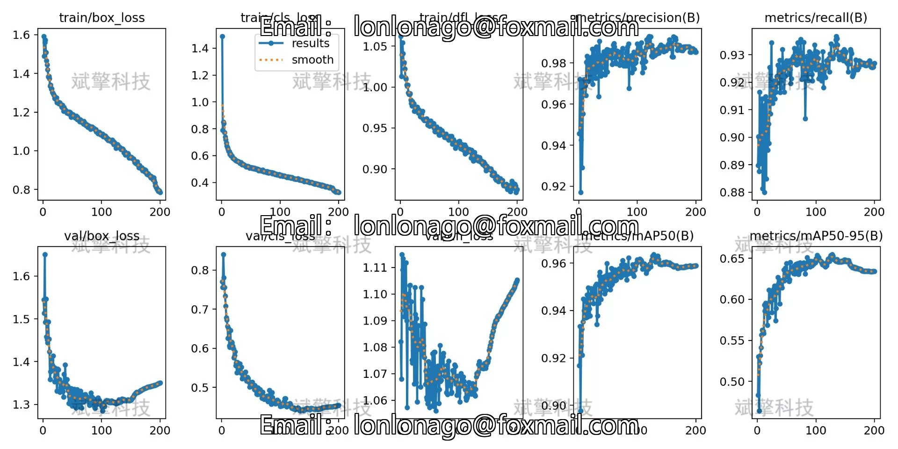
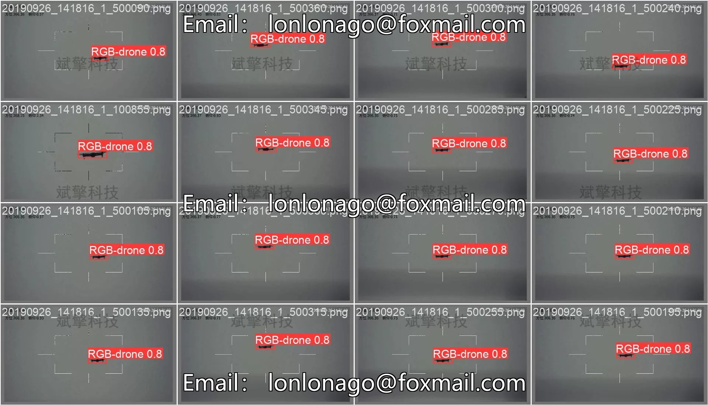

# YOLOv12 Drone Detection System

## Body

YOLOv12 Unmanned Aerial Vehicle (UAV) Detection System Based on Deep Learning YOLOv12, Vision-Based UAV Detection System (YOLOv12+YOLO dataset + UI interface + login and registration interface + Python project source code + model)

This project is based on the latest YOLOv12 object detection algorithm to develop a high-performance vision-based UAV detection system.
The system achieves precise recognition and localization of UAVs in images, video streams, and real-time camera views, providing an efficient and intelligent technical solution for low-altitude airspace safety monitoring. Experimental results show that the detection model based on YOLOv12 achieved excellent detection performance on self-built UAV datasets, effectively improving the detection accuracy of small targets while ensuring real-time detection speed.

System Function Overview

✅ User Login and Registration: Supports password verification and security validation.

✅ Three Detection Modes: Based on the YOLOv12 model, supports image, video, and real-time camera detection, accurately recognizes targets.

✅ Dual-Screen Comparison: Displays the original scene and detection results on the same screen.

✅ Data Visualization: Real-time table displays the category, confidence, and coordinates of detected targets.

✅ Intelligent Parameter Tuning: Offers a confidence slide bar, dynamically optimizes detection accuracy to meet different scene needs.

✅ Sci-Fi Style Interactive Interface: Dark theme combined with dynamic light effects, reduces visual fatigue and enhances operational experience.

✅ Multi-Thread High-Performance Architecture: Independent detection threads ensure smooth operation, real-time status prompts, and rapid response without lag.

Dataset Introduction

Training Set (Training Set): 5019 images
Validation Set (Validation Set): 1233 images

## Images

## Payment

Here is a pay link on Stripe ( https://buy.stripe.com/3cs8yP7sY87d0vu9AB ). Please contact me lonlonago@foxmail.com after funding $89, and I will send you a complete data files , thank you!

